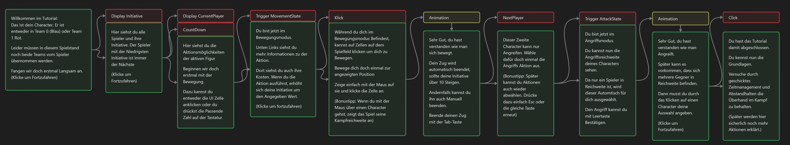

# BeanBattle

 
This is Bean Battle, a **Very** simple (probably) unfinished X-Com like game, just to try out different styles and Mechanics. 
It's more to be seen as a learning and testing Project than a finished game.
In its current state it needs to be played as a Hotseat multiplayer

---
ToDo:
- Next
  - Settings
  - Animations
    - Attack
  
- Enhancements
  - Better Song (Not that annoying)
  - Implement More Actions
    - Evil/Help as Healing or De-Buff
    - Hide/Cover
    - Over-watch
  - Optimisation
    - Check round end for time > 0
    - MovementState only on Cell Change
  - Better Hover Zone/ Indicator
  - Balancing
    - First team Has lower Time Overflow?
    - Faster Movement?
  - Fix Path Flickering

- Later Features:
  - AI
  - Terrain?
  - Controller Input

Math:
- [Desmos Graph Start-Positions](https://www.desmos.com/calculator/lqxf4nhqil)

StateController Planning:

Tutorial Planning:

Credits:
- [Title Font: Monaz 3D](https://www.fontspace.com/monaz-3d-font-f110367)
- Icons:
  - [Shaking hands icon by Delapouite](https://game-icons.net/1x1/delapouite/shaking-hands.html)
  - [Sword clash icon by Lorc](https://game-icons.net/1x1/lorc/sword-clash.html)
  - [Sly icon by Lorc](https://game-icons.net/1x1/lorc/sly.html) 
  - [Sprint icon by Lorc](https://game-icons.net/1x1/lorc/sprint.html)
  - Icons licensed under [CC3](https://creativecommons.org/licenses/by/3.0/)
- Music:
  - [Core Loop](https://opengameart.org/content/the-gears-of-progress)
- Effects: 
  Ticking, Steps, and Victory Sound Effects taken from <a href="https://pixabay.com/?utm_source=link-attribution&utm_medium=referral&utm_campaign=music&utm_content=83775">Pixabay</a>
